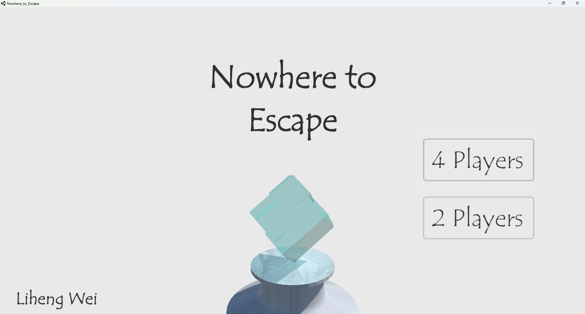
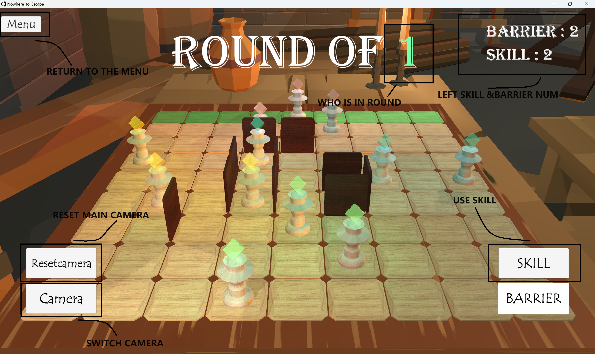
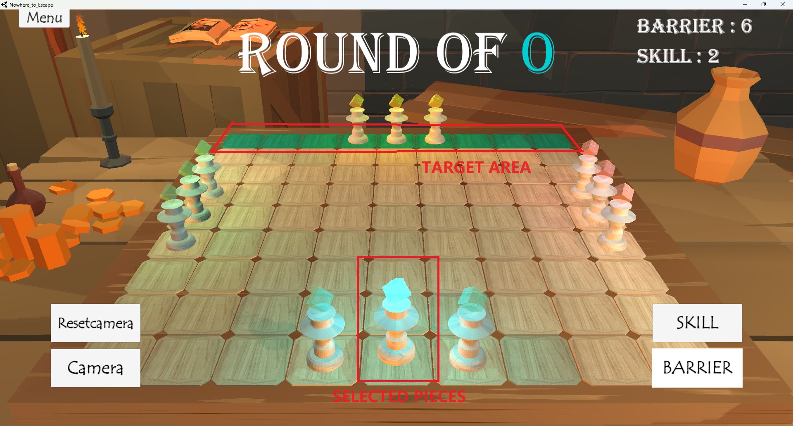
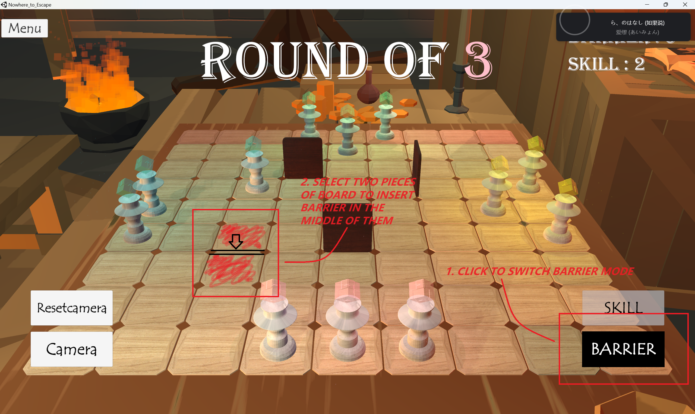
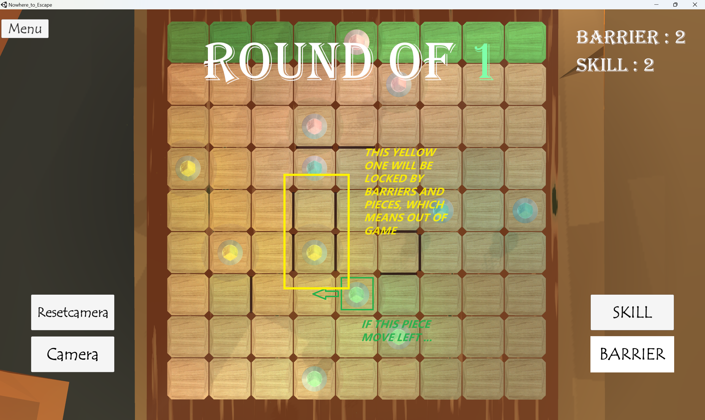
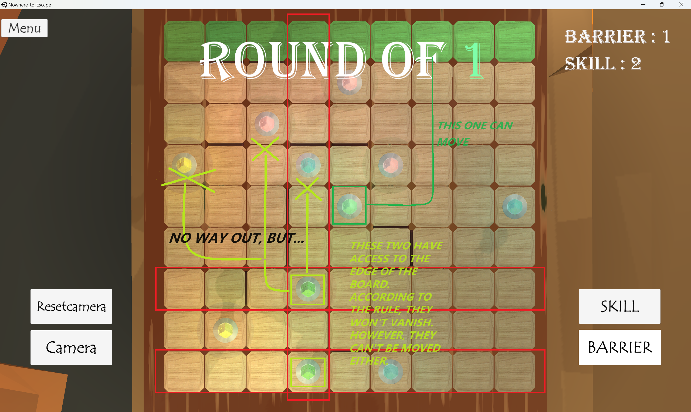

# Nowhere to Escape

**Nowhere to Escape** is an interesting party game with simple mechanism and everyone quickly join in the game and enjoy it! This game is basicly designed for 2 players' pair or 4 players' group, although I believe 4-people is the best choice. After read a brief menu below, everyone can have fun in this game soon! Enjoy the journey of widsdom and chaoes!

Download:[Nowhere to Escape - Google Drive](https://drive.google.com/drive/folders/1F4u9aTqu11e7nxPIPaPxRYDRQsnRCDFk?usp=sharing)

## Basic Rules

**First of all, reach the other side of the chessboard, and you will win !**

*Yes, you have a clear target now! Also, you can do that by moving your charactor once in a round, Easy one!*

**Second, Set Barriers to slow your opponent !**

*Moving some guys is too easy, so we have more options! you can set some barriers bettween the blocks of chessboard. However, you can't both set a barrier and move your charactor in one round. Work needs to be done one by one, right?*

**Last, Surround your opponent with the barrier and make them vanish !**

*Tired of circling around the annoying barriers, then surround your opponents to kill them once for all. A surrounded piece will be "nowhere to escape" and vanish. But you can only compelete the final piece of trap by you own piece. This may sound obscure, but the main idea is you can't surround your oppenent only by pluging in barriers.*

That's all you need to know for now, just download and enjoy it!

## Advanced Tech

Ok, so you want to know more about the rules and techs, Let's talk about this a little bit deeper. Since you probably have one or two rounds of game, you may find when sometimes you want to set barriers to block ways, the system denied your request. That's another rules in fact.

**Barries can't be set in the place where the barrier will compeletly block all the way to the target.**

*Fair Requirement, isn't that ?*

**However, you make a complete surrounding by moving pieces of yours.**

*Remeber that ? This is mentioned in the basic rules, surrounding will make your opponents vanish. Blade can't kill when no one is waving it, this is the same idea.*

**Sometimes, the surrounding will not be so effective.**

*There is a wired rule set in the game. If a piece become "nowhere to escape" but it is not surrounded perfectly, then it has another chance to live. under this situation, the piece will only be frozen instead of  out of game. This is designed for solve some potential abuse in the game, however maybe I will bring about some alternative rules in the future to achieve that.*

**Skills! Powerful magic power allows you to break one barrier once in a game!**

*I guess this is done by secretly removing the barreier on the board when someone goes to the toilet. Surely, I will develop more skills in the future, but now I want to keep the game as straight foward as it sounds.*

**Unlimited Power! Do not try to freeze all the piece of your opponents, or you will see a catastrophic show (unlimited use of skills).**

*I don't why people can do this, ask the god.*

## About Development

### TO DO

- [ ] More skills

- [ ] Expandable board

- [ ] In-Game guide UI

- [ ] service of online play 

### version update - 1.1

* Add Menu button to go back to menu convinently

* complete break effect when board and chess is destoried

* Add hint color to board to in order to show the targeted places

* Optimize the route-searching system of chesses
